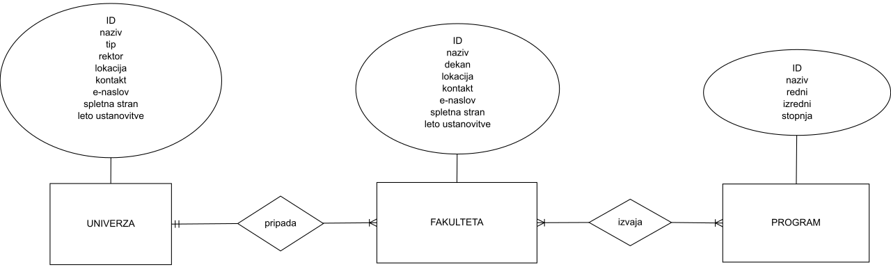

# Slovenske fakultete
Avtorja: Denis Benčič in Hana Kranjec Kelbel

V bazi bi zbrala osnovne podatke o slovenskih fakultetah.

Bazo bi sestavljale tabele univerza, fakulteta in program, ki bi bile med seboj povezane.
V prvi bi hranila osnovne podatke o univerzah: naziv, tip (javna ali zasebna), rektor (ali dekan), lokacija, kontakt, e-naslov in spletna stran.
V drugi bi hranila osnovne podatke o fakultetah: naziv, dekan, lokacija, kontakt, e-naslov, spletna stran in leto ustanovitve
V tretji bi hranila osnovne podatke o izvajanih programih: naziv, redni (logična vrednost), izredni (logična vrednost) in stopnja.

Glavni vir podatkov je Studentski.net ter Wikipedia.

Glavni namen in funkcionalnost baze bi bil hiter dostop in poizvedovanje do vseh podatkov na enem mestu, ki bi jih (bodoči) študentje, starši in osebje morda potrebovali.

